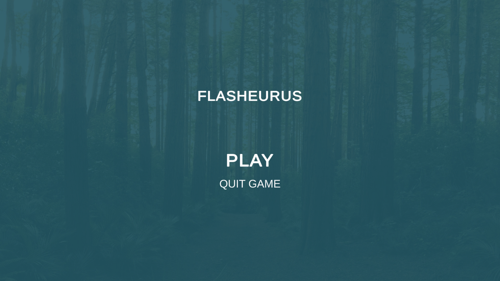
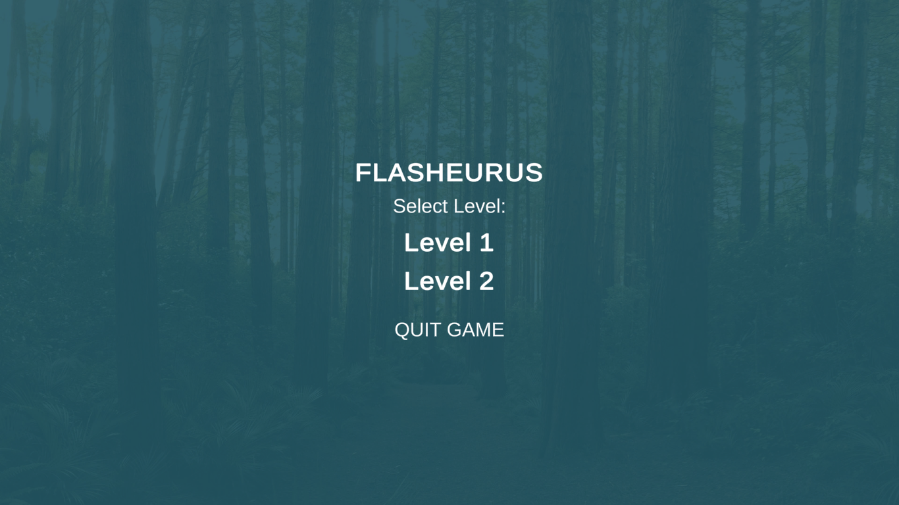
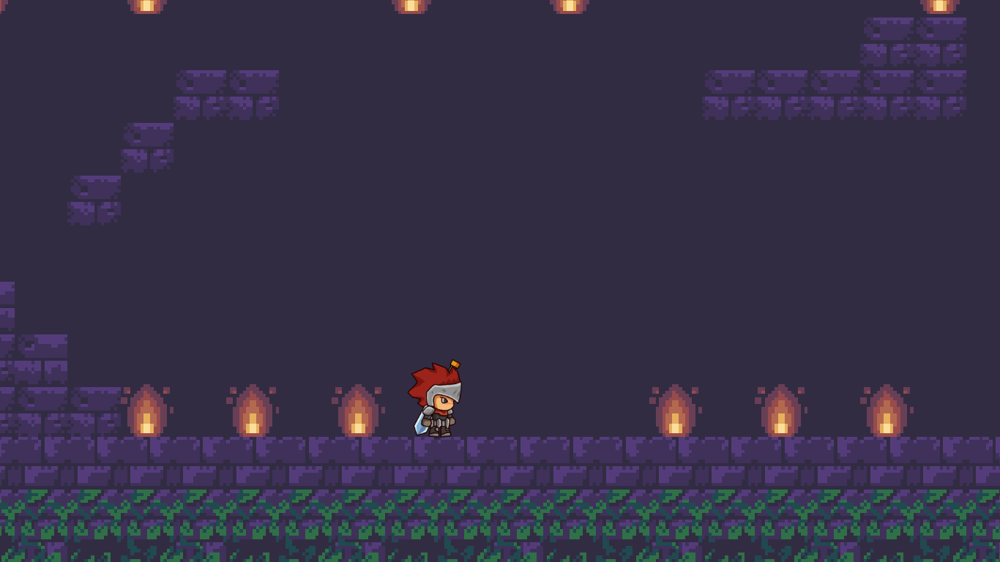
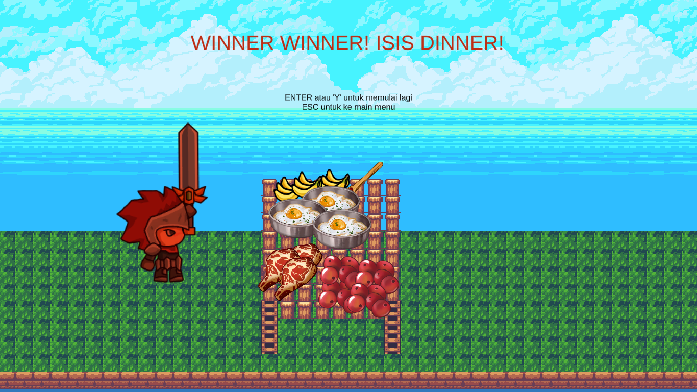
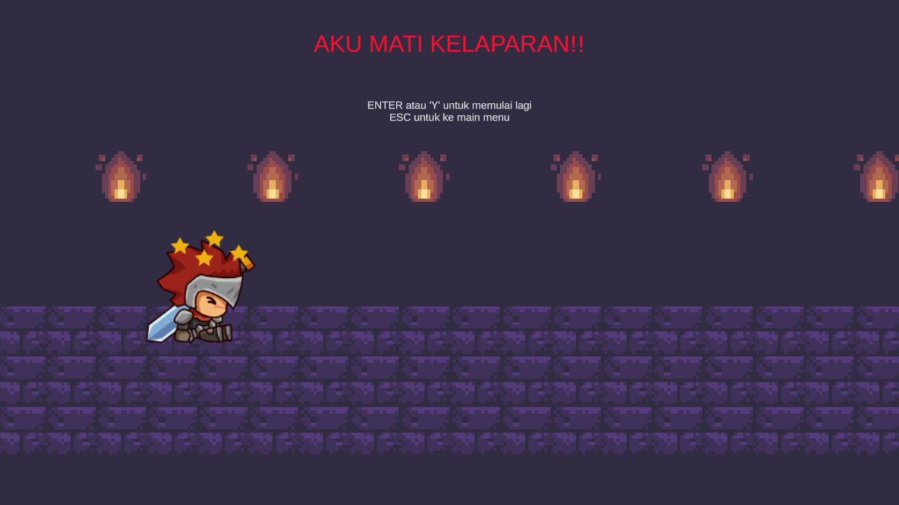

# Flasheurus
Game Flasheurus yang bertujuan untuk memenuhi tugas akhir mata kuliah Grafika Komputer.

## Storyline
Flasheurus merupakan game Episodic yang memiliki storyline dimana karakter utama harus berlari melalui rintangan secepat mungkin. Karakter utama sedang bermain keluar rumah, tetapi orangtuanya memanggil dia untuk pulang dan makan indofood sarimi isi dua buatan orangtuanya, sehingga ia harus segera pulang dan memenuhi panggilan orangtuanya.

## Gameplay
Game ini bertujuan untuk mendapatkan skor setinggi mungkin berdasarkan waktu tercepat untuk pulang kerumah. Pemain akan kalah jika karakter gagal pulang ke rumah setelah tenggat waktu. Rintangan game ini dapat berupa obstacle yang dapat menghalangi jalan atau objek yang bergerak untuk menghalangi jalan.

## Concept and Environment
Game bertemakan kawasan kehutanan. Objek dan obstacle akan menghalangi jalan karakter utama untuk menuju ke rumahnya. Pemain harus dengan bijak untuk melewati seluruh rintangan yang menghalangi untuk pulang kerumah secepat mungkin.

## Action:
- Karakter utama hanya bisa bergerak jalan ke arah kanan.
- Pemain harus bermanuver secerdas mungkin untuk menghindari obstacle dan objek
- Pemain dapat bergerak ke kiri dengan menekan tombol kiri.
- Pemain dapat bergerak ke kanan dengan menekan tombol kanan.
- Pemain dapat bergerak ke atas atau lompat dengan menekan tombol spasi.

### Note
- Aset model game merupakan standar aset dari Unity.
- Design UI merupakan buatan sendiri.
- Tutorial didapatkan dari Youtube ,Unity Documentation, dan Unity Forum.
- Pematangan ide dan konsep game dibantu oleh asisten praktikum dan dosen mata kuliah Grafika Komputer.

## Developer
<table>
  <th>
    Nama
  </th>
  <th>
    Peran
  </th>
  <tr>
    <td>
      Muhammad Alfin Khalidi
    </td>
    <td>
      Game Programmer, Game Designer
    </td>
  </tr>
  <tr>
    <td>
      Morgan Mendel
    </td>
    <td>
      Game Artist
    </td>
  </tr>
  <tr>
    <td>
      Rafid Rudy Darmawan
    </td>
    <td>
      Game Artist
    </td>
  </tr>
</table>

## Tech-Stack
<table>
  <th>
    Nama Software
  </th>
  <th>
    Fungsi
  </th>
  <tr>
    <td>
      Unity 2018.4.11f1
    </td>
    <td>
      Mengatur pembuatan game, pengolahan aset, penggunaan script, dan kolaborasi
    </td>
  </tr>
  <tr>
    <td>
      Visual Studio Code
    </td>
    <td>
      Mengetik script menggunakan bahasa C#
    </td>
</table>

## Screenshot In-Game
Main Menu

Level 1

Level 2

Finish

Game Over

